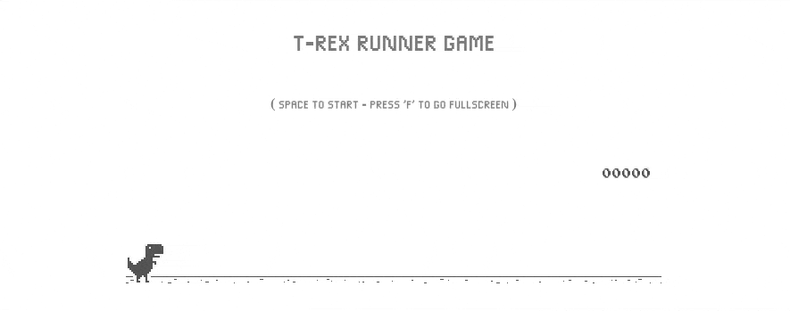

# T-Rex Runner from Chromium 2024
<!-- ALL-CONTRIBUTORS-BADGE:START - Do not remove or modify this section -->
[](#contributors-)
<!-- ALL-CONTRIBUTORS-BADGE:END -->

This is the latest version of the T-Rex Runner source code, extracted from the newly migrated Chromium repository. We have enhanced it further to make it independent of the Chromium browser and to improve the overall code structure. This is the latest codebase written in ES6, free from the circular dependencies present in the original source, making it easy to integrate into modern frameworks like React, Next.js, and others. Below, you’ll find updated documentation to help you start editing the game and creating your own customized variant.



## Updating Game Assets

The game assets are loaded from the offline-resources div in the HTML. There are two main types of assets:

1. Sprite Images

- Two sprite files are used to support different display densities:
  - `/images/default_100_percent/100-offline-sprite.png` (1x density)
  - `/images/default_200_percent/200-offline-sprite.png` (2x density)
- These sprite sheets contain all game graphics including:
  - T-rex character animations
  - Background elements
  - Obstacles and game objects
  - UI elements

2. Audio Resources
   The game sounds are embedded directly in the HTML as base64 encoded audio:

- Press sound - Played when jumping
- Hit sound - Played on collision
- Reached sound - Played when reaching score milestones

The game automatically selects the appropriate sprite sheet based on the device's pixel density. The 2x sprite is used for high DPI displays to maintain sharp graphics.

To modify the game assets:

- Edit the sprite sheets to change visuals
- Replace the base64 audio strings to update sounds
- Keep the same sprite layout/coordinates when modifying graphics

> Its required to always import atleast 1 CSS Stylesheet. The game logic injects some css in the first stylesheet if its not found then it will crash.

## Initializing Game

The game can be initialized using the Runner class - it takes the container element for the game and optional configs. Using the Runner class you can create a new instance and this instance can be used to control the game settings and events.

Example:

```js
const trexGameContainer = document.querySelector('.trex-game');
const runner = new Runner(trexGameContainer);
console.log(runner); // to see all the available methods
```

## Custom Changes We Made

We have extracted this source code from chromium and have made some changes on the top the source code to make it runnable with modern frameworks. All the changes can be tracked in the codebase using the fingerprint comment structure "@change -> Change reason".

1. Refactored Runner function to class.
2. Removed singleton pattern which prevents initializing another instance from the Runner class.
3. Removed slow speed mode checkbox. (It can still be enabled by clicking on the T-Rex first and then starting the game)
4. Attached Runner to `window.Runner` and removed circular dependency in any files. (Modern compilers treat it as a bad practice and throws an error)
5. Migrated some deprecated functions.

## How to run in new project?

1. Copy resources folder to your project.
2. Copy images folder to your public folder.
3. Copy `trex.css` to your folder and import it in your HTML file or React component.
4. In you html file or component add the div with id `offline-resources` from the `index.html`.
5. Create a new script which will import the `Runner` class from the `offline.js` file and create a new instance. (Similar to `script.js`)
6. This should run the dino game in your project. You may need to adjust the styling of your container.

## What is Slow Speed Mode?

Slow Speed Mode is an accessibility setting that makes the game more accessible for people with vision impairments. When enabled, it:

- Reduces the game speed and acceleration
- Enables audio cues when obstacles are approaching
- Adjusts the gap between obstacles to be more forgiving
- Lowers the maximum speed cap

This mode can be activated by:

1. Clicking on the T-Rex character before starting the game
2. Then starting the game normally

The specific adjustments made in slow mode include:

- Slower acceleration (0.0005 vs 0.001)
- Lower max speed (9 vs 13)
- Smaller gaps between obstacles (0.3 vs 0.6 coefficient)
- Audio proximity threshold adjusted for better cues

This allows players with visual impairments to rely more on audio feedback and have more time to react to obstacles, making the game more inclusive and enjoyable for all players.

## Runner methods

The Runner class provides several methods to control the game. Here are the key methods available:

### Game Control Methods

- `setSpeed(speed: number)` - Sets the game speed to a specific value
- `setArcadeMode()` - Enables arcade mode with different positioning and behavior
- `restart()` - Restarts the game from the beginning
- `play()` - Starts/resumes the game
- `stop()` - Pauses the game
- `crash()` - Triggers the crash animation and game over state

### Input Methods

- `onKeyDown(e: KeyboardEvent)` - Handles keyboard input for controls
- `onKeyUp(e: KeyboardEvent)` - Handles keyboard key release events
- `onGamepadConnected(e: GamepadEvent)` - Handles gamepad connection
- `onGamepadDisconnected()` - Handles gamepad disconnection

### Visual Methods

- `invert()` - Inverts the game colors (dark/light mode)
- `update()` - Updates game objects and animations each frame
- `clearCanvas()` - Clears the game canvas
- `updateCanvasScaling()` - Updates canvas size based on device pixel ratio

### Sound Methods

- `generatedSoundFx.init()` - Initializes sound effects
- `playSound(soundType)` - Plays a specific sound effect
- `stopAllSounds()` - Stops all currently playing sounds

### State Methods

- `isRunning()` - Returns whether game is currently running
- `hasObstacles()` - Checks if there are active obstacles
- `isArcadeMode()` - Checks if arcade mode is enabled
- `isInvertedMode()` - Checks if colors are inverted

### Score Methods

- `updateHighScore(highScore)` - Updates the high score
- `distanceRan()` - Gets the current distance/score
- `getSpeedY()` - Gets current vertical speed

## Older Source Code

The older source code from 2016 can be found in the [wayou/t-rex-runner](https://github.com/wayou/t-rex-runner) repository. This version uses ES5 syntax without classes. Shout-out to [@wayou](https://github.com/wayou) for maintaining it.

Key differences from the current version:

- Uses constructor functions instead of ES6 classes
- No module system, all code in one file
- Global namespace with `Runner` object
- Prototype-based inheritance
- No strict mode
- Older browser compatibility

## Original Chromium Repository

Source Code : https://source.chromium.org/chromium/chromium/src/+/main:components/neterror/resources/

Github Mirror : https://github.com/chromium/chromium/tree/main/components/neterror/resources

## Contributing

Feel free to open [issues](https://github.com/devfolioco/t-rex-runner-game/issues/new/choose) and [pull requests](https://github.com/devfolioco/t-rex-runner-game/pulls)!

## Contributors ✨

Thanks goes to these wonderful people ([emoji key](https://allcontributors.org/docs/en/emoji-key)):

<!-- ALL-CONTRIBUTORS-LIST:START - Do not remove or modify this section -->
<!-- prettier-ignore-start -->
<!-- markdownlint-disable -->
<table>
  <tbody>
    <tr>
      <td align="center" valign="top" width="14.28%"><a href="https://prathamvaidya.in"><br /><sub><b>Pratham Vaidya</b></sub></a><br /><a href="#maintenance-prathamVaidya" title="Maintenance">🚧</a></td>
      <td align="center" valign="top" width="14.28%"><a href="https://preetjdp.dev/"><br /><sub><b>Preet Parekh</b></sub></a><br /><a href="#research-preetjdp" title="Research">🔬</a> <a href="#ideas-preetjdp" title="Ideas, Planning, & Feedback">🤔</a></td>
    </tr>
  </tbody>
</table>

<!-- markdownlint-restore -->
<!-- prettier-ignore-end -->

<!-- ALL-CONTRIBUTORS-LIST:END -->

This project follows the [all-contributors](https://github.com/all-contributors/all-contributors) specification. Contributions of any kind welcome!